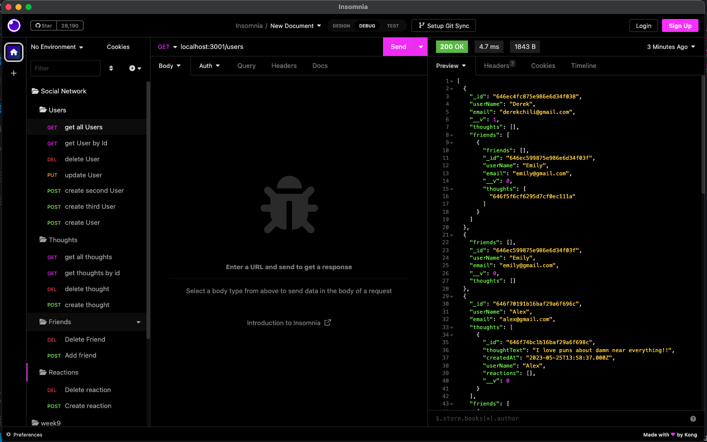
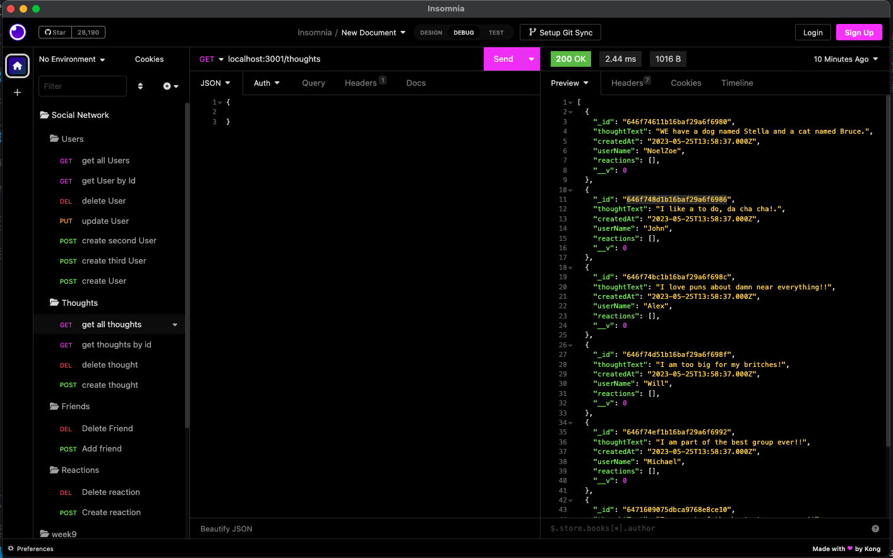
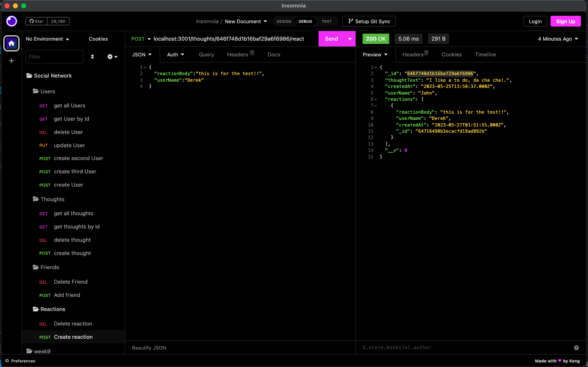

# Social-NetworkDC

## Description

This is a social network using a NoSQL database, that way it can handle a large amount of unstructured data. Built on MongoDB
## Installation

When you first open it, right click on the main index file and open intergrated terminal. Then after you clone it, run "npm i" then "npm run index.js" Then you can go to insomnia to check out all the different routes that are in the routes folders showing the paths.

## Usage

Video Walkthrough: https://drive.google.com/file/d/1td8DtJZYGfGBcI90rEjANZr2nSfAuq3p/view

GitHub link: https://github.com/Derekchili/Social-NetworkDC.git

## Credits

Made by Derek Chilson, I had help from a Tutor Andres Jiminez

